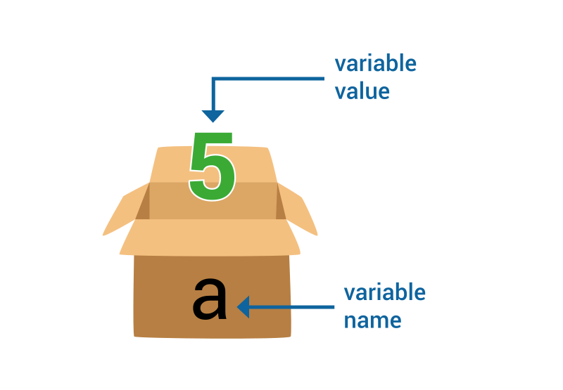

# <b>The Basic Roadmap is divided into 20 Sections in 60 Days</b>

## <b><i>So Per Topic 3 Days (1 Topic = 3 Days)</i></b>
<ol>
<li><i>Introduction and Basics of Python</i></li>
<li><i>Operators</i></li>
<li><i>Conditional Statements</i></li>
<li><i>While Loops</i></li>
<li><i>Lists</i></li>
<li><i>Strings</i></li>
<li><i>For Loop</i></li>
<li><i>Functions</i></li>
<li><i>Dictionary</i></li>
<li><i>Tuples</i></li>
<li><i>Set</i></li>
<li><i>File Handling</i></li>
<li><i>Exception Handling</i></li>
<li><i>Regular Expression</i></li>
<li><i>Modules and Packages</i></li>
<li><i>Python Web Scrapping</i></li>
<li><i>Python Package Manager</i></li>
<li><i>Database Operations Using Python</i></li>
<li><i>Converting .py Files To .exe </i></li>
<li><i>Deployment</i></li>
</ol>


# ```#Roadmap -  Way To Learn Python Easy```


## <b>Introduction and Basics of Python</b>

<details>
   <summary>Day 0</summary>
<ul>
   <br>
   <li><h3>Installation & Setup </h3></li>
   <i>I Suggest You To Use The Following Environment To Practice And Understand The Python Concept Easy Way</i>
   <b>For Android Users : </b><code>https://play.google.com/store/apps/details?id=app.compiler</code><br>
   <b>For Computer Users :</b> <code>https://replit.com/languages/python3</code>

   <li><h3>Print function</h3></li>
   <b> Definition and Usage Print Statement :</b>

<i>The print() function prints the specified message to the screen, or other standard output device.
The message can be a string, or any other object, the object will be converted into a string before written to the screen</i><br>
Syantax : 
```python 
print("Hello World !")
```

<li><h3>First Program</h3></li>

```python
print("My Name Is Bobby") #Add Your Name Here
print('My Age Is 21') #Add Your Age Here
```
OUTPUT : 
```
My Name Is Bobby
My Age Is 21
```
</ul>
</details>

<details open>
      <summary>Day 1</summary>
      <br>
         <h3>What Is A Variable ?</h3>
         <b><i>A Variable is like a container which stores data in it and we can access that data by using the container label</i></b><br>
         
         <center>
<h1>a = 5 </h1>
         </center><br>
<ul>
<h1>Rule Of Variable's</h1>
<li>Variable names are case-sensitive (age, Age and AGE are three different variables)</li>
<li>A variable name cannot start with a number </li>
<li>A variable name can only contain alpha-numeric characters and underscores (A-z, 0-9, and _ )</li>
<li>A variable name must start with a letter or the underscore character</li>
</ul>

```python
variable_name = "Variable Value" # ====> Must Use " " For Value Declaration

my_name = "Mr RoBoT" # We Declared A Variable 

#accessing Varible Data 

print(my_name) #Dont Use " " Here While Calling Variable

```
</details>


